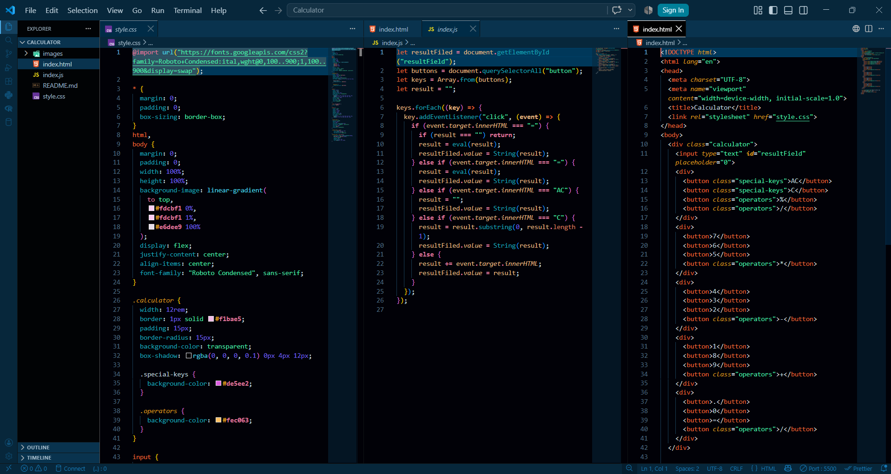
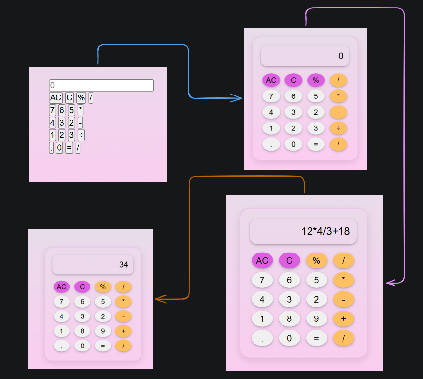

# Calculator Project ( aka my first Github flex 😆)

Welcome to my very first GitHub project!  
Yes, it’s a calculator. No, it won’t solve world hunger… but it *will* add, subtract, multiply, and divide like a champ. 

---
## Features (aka superpowers)
- ➕ Addition (because who doesn’t like more stuff?)
- ➖ Subtraction (for when life takes away… sigh)
- ✖ Multiplication (math flex 💪)
- ➗ Division (sharing is caring)
- 🧹 AC button => wipes everything like a memory reset
- 🔙 C button => deletes one character (oops-proof)
- 🟰 Equals button => does the actual math magic

---

## 📸 Screenshots
Proof that I actually coded this thing (and didn’t just dream it).

### Development Chaos


### Shiny Calculator UI


---

## 🔗 Live Demo
Play with it here 👉 [CodePen Link](https://codepen.io/editor/ancryne/pen/019fe28f-4368-73da-bf41-32560394c8d9) [ Hit ❤️ ]

---

## Project Files 📂
```
Calculator
├─ images
│  ├─ Calculator_UI.png
│  └─ Dev_Process.png
├─ index.html
├─ index.js
├─ README.md
└─ style.css
```

---

## How to Run
1. Clone this repo like a pro:
   ```bash
   git clone https://github.com/your-username/calculator.git
   ```
2. Enter the calculator dojo:
   ```bash
   cd calculator
   ```
3. Double-click `index.html` and boom 💥 math time.

---

## Future Plans
- Turn it into a **scientific calculator** (sin, cos, tan, log, π, e… all the nerdy stuff).
- Add **keyboard support** (because clicking is sooo 2005).
- Dark mode (because developers love darkness).
- Error handling (so it doesn’t scream at you when you type `2++`).

---

## ❤️ Personal Note
I used to build and learn lots of things but never shared them.  
Now I’m flipping the script from this project onward, I’ll share whatever I build and learn here.  
So buckle up, GitHub, you’re about to see some wild experiments.  

Built with ♥ by **Ancryne** ✨


